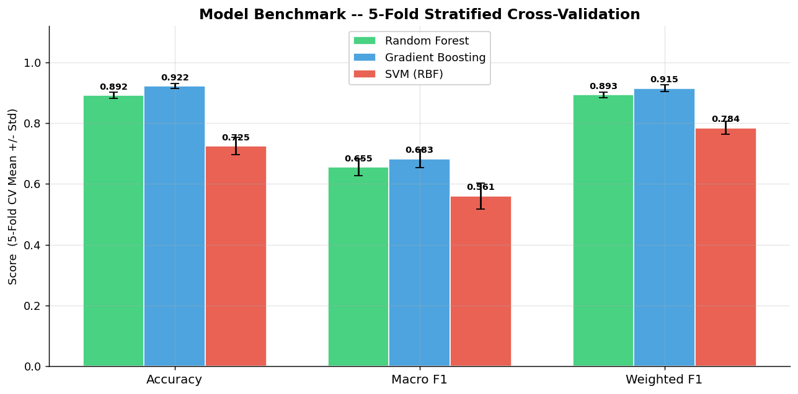
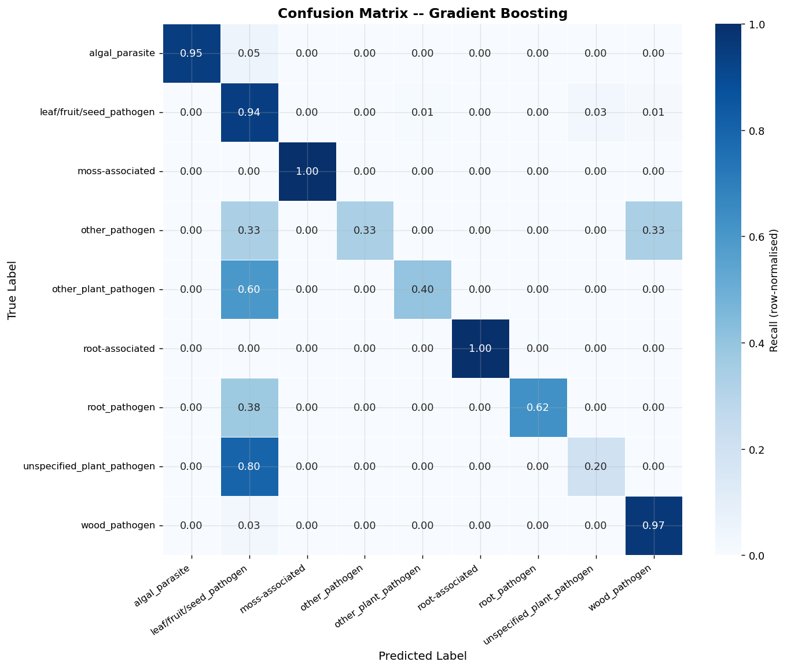
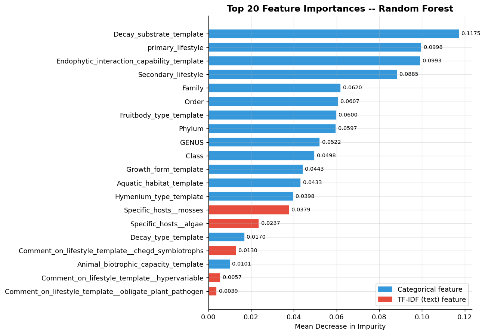
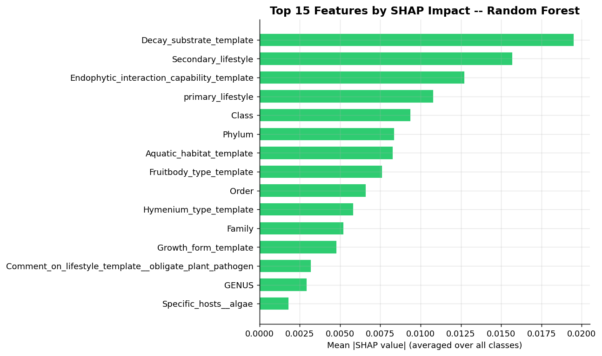
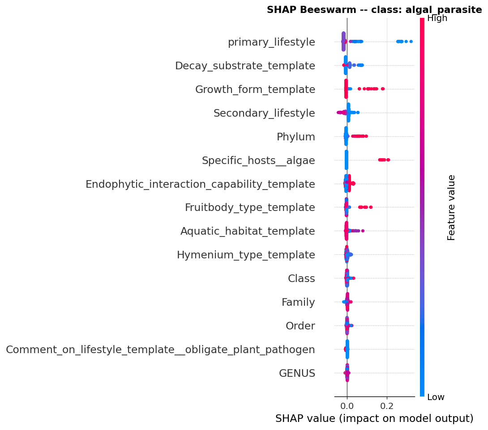
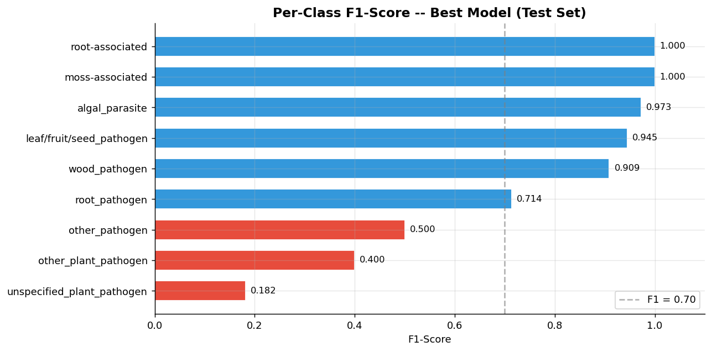
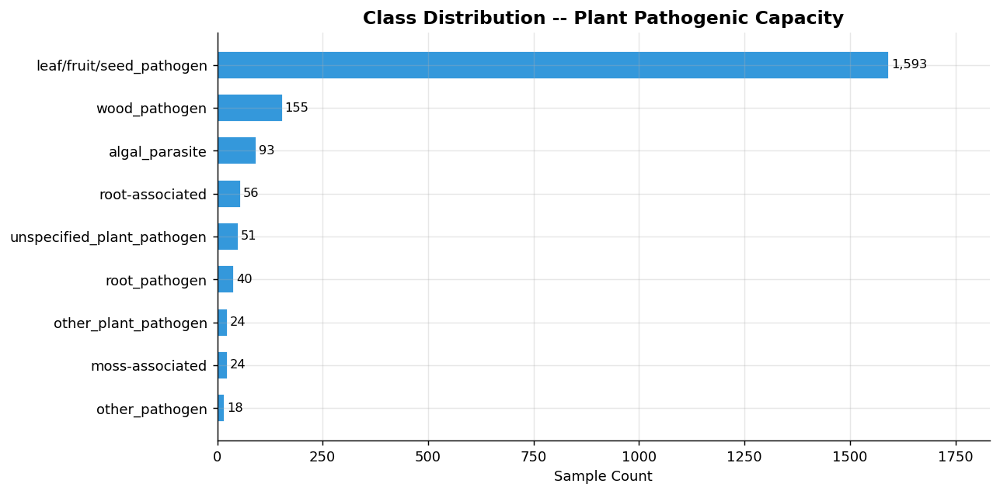

# 🍄 Fungal Pathogenicity Predictor

<p>
  
  
  
  
</p>

End-to-end ML pipeline for classifying fungal plant pathogenicity from ecological and morphological trait data, using the [FungalTraits v1.2](https://link.springer.com/article/10.1007/s13225-020-00466-2) dataset.

---

## Results

| Model | CV Accuracy | CV Macro F1 | CV Weighted F1 |
|---|---|---|---|
| **Gradient Boosting** | **92.2%** | **0.683** | **0.915** |
| Random Forest | 89.2% | 0.655 | 0.893 |
| SVM (RBF) | 72.5% | 0.561 | 0.784 |

*5-fold stratified cross-validation · Macro F1 is primary metric given 78% class imbalance*

**Test set (held-out 20%): 91.2% Accuracy · 0.736 Macro F1**

---

## Visualisations

### Model Benchmark


### Confusion Matrix — Gradient Boosting


### Top 20 Feature Importances — Random Forest


### SHAP Analysis — Feature Impact



### Per-Class F1 Score


---

## Dataset

- **Source**: FungalTraits v1.2 — 10,771 fungal genera with ecological and morphological traits
- **Labeled samples**: 2,054 genera with confirmed plant pathogenic capacity
- **Target classes**: 9 classes after consolidating rare / multi-label entries
- **Class imbalance**: `leaf/fruit/seed_pathogen` accounts for ~78% of labeled data

### Class Distribution


---

## Feature Engineering

Two-stage hybrid pipeline via `sklearn.ColumnTransformer` (no data leakage — fit only on training split):

**Categorical (19 columns)** — `OrdinalEncoder` with `NaN` as its own category (`encoded_missing_value=-2`)

> Missingness is biologically meaningful: a null `Decay_substrate` signals the fungus is not a decomposer. Imputing it would destroy that signal.

**Text (2 columns)** — `TfidfVectorizer` (max 100 features, `min_df=2`) on host names and lifestyle comments

**Total feature dimensions: 88**

---

## Key Design Decisions

| Decision | Reason |
|---|---|
| NaN → own category (not imputed) | Missingness encodes biological absence, not data error |
| Class consolidation → `other_pathogen` | Multi-label combos (<10 samples) break stratified CV |
| `class_weight='balanced'` on all models | Prevents 78% majority class dominating loss |
| Macro F1 as primary metric | Weights all 9 classes equally; not skewed by majority |
| Gradient Boosting as best model | +3% CV accuracy and +3% Macro F1 vs Random Forest |
| RF trained separately for SHAP | `TreeExplainer` gives fast, exact Shapley values |

---

## SHAP Interpretability

Top predictors identified by SHAP:

- **`primary_lifestyle` / `Secondary_lifestyle`** — strongest features; encode fundamental ecological strategy
- **`Class`, `Order`, `Family`** — phylogenetic signal; related fungi share pathogenic strategies
- **`Decay_substrate_template`** — sharply separates saprotrophs from pathogens
- **`Endophytic_interaction_capability_template`** — distinguishes obligate from facultative pathogens

---

## Project Structure

```
.
├── main.py                  # Full pipeline orchestration
├── src/
│   ├── preprocess.py        # DataProcessor: load, consolidate classes, ColumnTransformer
│   ├── models.py            # RF / GradBoost / SVM + 5-fold CV benchmark
│   ├── evaluate.py          # Metrics, classification report, SHAP computation
│   └── visualize.py         # 7 publication-quality plots → results/
├── results/                 # All plots + trained model + CV CSV
├── fungal_trait.csv         # Raw FungalTraits dataset
└── requirements.txt
```

---

## Setup

```bash
pip install -r requirements.txt
python main.py
```

All 7 plots and the trained model are saved to `results/`.

---

## Generated Outputs

| File | Description |
|---|---|
| `01_class_distribution.png` | Sample counts per class |
| `02_model_comparison.png` | CV benchmark — 3 models × 3 metrics with error bars |
| `03_confusion_matrix.png` | Row-normalised confusion matrix |
| `04_feature_importance.png` | Top 20 RF feature importances |
| `05_shap_importance.png` | Mean absolute SHAP across all classes |
| `06_shap_beeswarm.png` | SHAP beeswarm for dominant class |
| `07_per_class_f1.png` | Per-class F1 breakdown |
| `best_model.pkl` | Serialised Gradient Boosting pipeline |
| `cv_results.csv` | Full CV results table |
